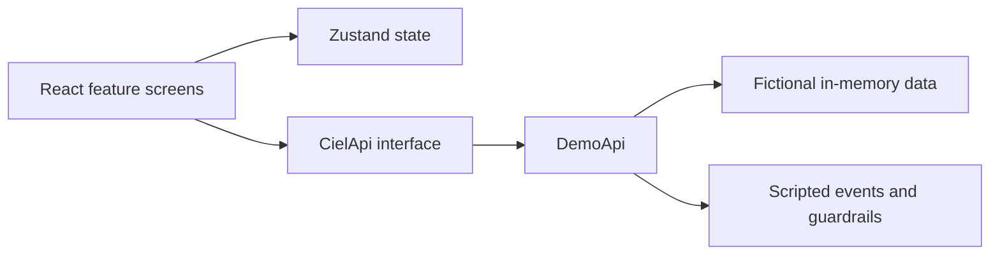

# Ciel

A system design specification and interactive frontend demo for a personal IT assistant.

## Overview

This checkout combines an interactive React/TypeScript simulation with a system design specification. The demo uses fictional notes, tasks, conversations, projects, email, and device records. The backend, database, model providers, and physical integrations described in the specification are not implemented in this checkout.

Workspace data, tokens, preferences, and exploration progress remain in memory. Reloading resets the demo and returns to the unlock screen.

## Features

- Twelve workspace screens for chat, notes, tasks, projects, audit, brief, voice, email, device, health, Build Map, and settings.
- Fifteen scripted chat scenarios with streamed text, tool steps, citations, cancellation, and confirmation-gated writes.
- Deterministic note retrieval, note capture/indexing states, task editing, and optimistic rollback.
- Fictional mailbox and device interactions, editable transcript replay, and local WAV calibration tones.
- Theme, density, reduced-motion controls, keyboard navigation, Flow Explorer, and Dev Lens.
- A production build with local fonts, PWA assets, and static-shell caching.

## Demo

Run the app locally using the quick start below.

## Quick start

Use **Node.js 25.6.1** and **npm 11.9.0**, the versions verified for this checkout. From the repository root:

```sh
npm install
npm run dev
```

Open http://127.0.0.1:5173. Select **Use demo token**, then **Unlock workspace**. The token is fictional; the unlock flow validates its format rather than authenticating with a server.

No environment file, API key, model provider, microphone, mailbox, or physical device is required. Port 5173 must be available because the development server uses a strict port.

For the production bundle:

```sh
npm run build
npm run preview
```

Open the local URL printed by Vite. **Flow Explorer** runs guided scenarios; `Shift+D` opens Dev Lens and simulated loading, empty, and error states. See the [frontend guide](ciel-web/README.md) for shortcuts and interaction details.

## Architecture

The implemented frontend has feature modules, shared controls, Zustand stores, typed API contracts, and a single in-memory `DemoApi` adapter. Its collections, lexical retrieval, guardrails, and scripted event streams drive the interface.



The [system architecture](docs/architecture.md) defines a FastAPI gateway, provider adapters, PostgreSQL/pgvector, scoped tools, and isolated integrations. The [API specification](docs/api.md) describes HTTP and streaming contracts. Those documents describe the system design; the diagram above describes the executable frontend.

## Tech stack

| Area               | Implementation                                   |
| ------------------ | ------------------------------------------------ |
| UI                 | React, TypeScript, React Router                  |
| State              | Zustand                                          |
| Build              | Vite, TypeScript, vite-plugin-pwa                |
| Styling and motion | CSS, Tailwind CSS, Framer Motion, Lucide icons   |
| Markdown           | react-markdown, remark-gfm, rehype-sanitize      |
| Dates and fonts    | date-fns, date-fns-tz, local Fontsource packages |
| Quality checks     | Vitest, ESLint                                   |
| Asset tooling      | Node.js scripts and Sharp                        |

Dependency versions are recorded in [package-lock.json](package-lock.json).

## Configuration

The frontend does not read environment variables. [.env.example](.env.example) is a configuration reference for the system specification; its values do not configure the running demo. Credential entries are placeholders or empty, and real values belong only in an ignored local environment file.

| Variable                            | Example/default            | Specification purpose                                                        |
| ----------------------------------- | -------------------------- | ---------------------------------------------------------------------------- |
| `CIEL_TOKEN`                        | `<YOUR_CIEL_TOKEN>`        | User bearer token; distinct from the device token and at least 32 characters |
| `DEVICE_TOKEN`                      | Empty                      | Optional device-scoped bearer token; empty disables those routes             |
| `CIEL_LLM_PROVIDER`                 | `groq`                     | Provider selection: groq, gemini, or ollama                                  |
| `CIEL_LLM_MODEL`                    | Empty                      | Provider-supported model identifier                                          |
| `GROQ_API_KEY`                      | Empty                      | Groq provider credential                                                     |
| `GEMINI_API_KEY`                    | Empty                      | Gemini provider credential                                                   |
| `OLLAMA_BASE_URL`                   | `http://localhost:11434`   | Local provider endpoint                                                      |
| `CIEL_EMBEDDING_MODEL`              | `nomic-embed-text-v1.5`    | Embedding model named in the architecture                                    |
| `CIEL_TIMEZONE`                     | `Asia/Manila`              | Relative-date timezone                                                       |
| `CIEL_DEMO_MODE`                    | `false`                    | System replay-isolation policy                                               |
| `POSTGRES_USER`                     | `ciel`                     | Database username                                                            |
| `POSTGRES_PASSWORD`                 | `<YOUR_DATABASE_PASSWORD>` | Database credential                                                          |
| `POSTGRES_DB`                       | `ciel`                     | Database name                                                                |
| `DATABASE_URL`                      | Commented example          | Optional API connection string outside the reference layout                  |
| `SEARCH_API_KEY`                    | Empty                      | Search-provider credential                                                   |
| `CIEL_ENCRYPTION_KEY`               | Empty                      | Encryption key for mailbox credentials                                       |
| `GMAIL_OAUTH_CLIENT_ID`             | Empty                      | Read-only mailbox OAuth client                                               |
| `GMAIL_OAUTH_CLIENT_SECRET`         | Empty                      | Mailbox OAuth client secret                                                  |
| `CIEL_EMAIL_POLL_INTERVAL`          | `60`                       | Poll interval in seconds; specified range 15–3600                            |
| `CIEL_AUTOMATION_MAX_RUNS_PER_HOUR` | `10`                       | Per-automation execution cap                                                 |

[docker-compose.reference.yml](docs/reference/docker-compose.reference.yml) records the deployment design. Its backend build contexts do not exist in this checkout, so it does not deploy the frontend demo.

## Project structure

```text
Ciel/
├── package.json / package-lock.json  npm workspace scripts and locked dependencies
├── .env.example                     System configuration reference
├── .editorconfig / .gitattributes    Editor settings and LF line endings
├── .nvmrc                           Verified Node.js version
├── LICENSE                          MIT license
├── README.md                        Project overview and verified demo setup
├── CONTRIBUTING.md                  Development workflow and contribution checklist
├── CHANGELOG.md                     Version history
├── CODE_OF_CONDUCT.md               Community standards and reporting process
├── SECURITY.md                      Vulnerability reporting policy
├── AGENTS.md                        Commands and conventions for coding agents
├── docs/
│   ├── DESIGN.md                    Interface design
│   ├── PRODUCT.md                   Demo scope and behavior
│   ├── architecture.md / api.md     System architecture and API specifications
│   ├── mvp.md / security.md         Core scope and security design
│   ├── evaluation.md                Testing approach and evaluation criteria
│   └── reference/                   Reference deployment layout
├── ciel-web/
│   ├── src/api/                     Typed contract and in-memory implementation
│   ├── src/features/                Workspace screens, shell, unlock, and guided flows
│   ├── src/state/                   In-memory Zustand stores
│   ├── src/design/                  Shared components and original visual assets
│   ├── src/lib/                     Dates, hashing, citations, Markdown, and query helpers
│   ├── src/styles/                  Theme, layout, and motion rules
│   ├── scripts/                     Icon generator
│   ├── public/                      Favicon and PWA icons
│   └── README.md                    Frontend guide
└── private/                         Ignored local working material
```

## Testing and linting

Run the existing checks from the repository root:

```sh
npm test
npm run lint
npm run build
```

Vitest discovers colocated `src/**/*.test.ts` files. The suite covers scripted flows, dates, canonical hashes, citations, confirmations, validation, cancellation, and API invariants. ESLint checks frontend source; the build also runs strict TypeScript checks.

## Documentation

| Document                                               | Contents                                              |
| ------------------------------------------------------ | ----------------------------------------------------- |
| [Frontend guide](ciel-web/README.md)                   | Commands, shortcuts, and simulation boundaries        |
| [Interface design](docs/DESIGN.md)                     | Visual language, motion, and responsive interaction   |
| [Product scope](docs/PRODUCT.md)                       | Demo behavior and specification boundary              |
| [Architecture](docs/architecture.md)                   | System components, data model, and deployment design  |
| [API](docs/api.md)                                     | Endpoint contracts, error types, and streaming events |
| [Core system specification](docs/mvp.md)               | Core requirements and acceptance criteria             |
| [Security design](docs/security.md)                    | Threat model and guardrail specifications             |
| [Evaluation design](docs/evaluation.md)                | Testing approach and evaluation criteria              |
| [Contributing](CONTRIBUTING.md)                        | Setup, code conventions, and contribution checks      |
| [Changelog](CHANGELOG.md)                              | Version history                                       |
| [Security policy](SECURITY.md)                         | Vulnerability reporting and supported versions        |
| [Code of conduct](CODE_OF_CONDUCT.md)                  | Community standards and reporting                     |

## License

MIT. See [LICENSE](LICENSE).

## Author

Jian Kieth Cabahug
