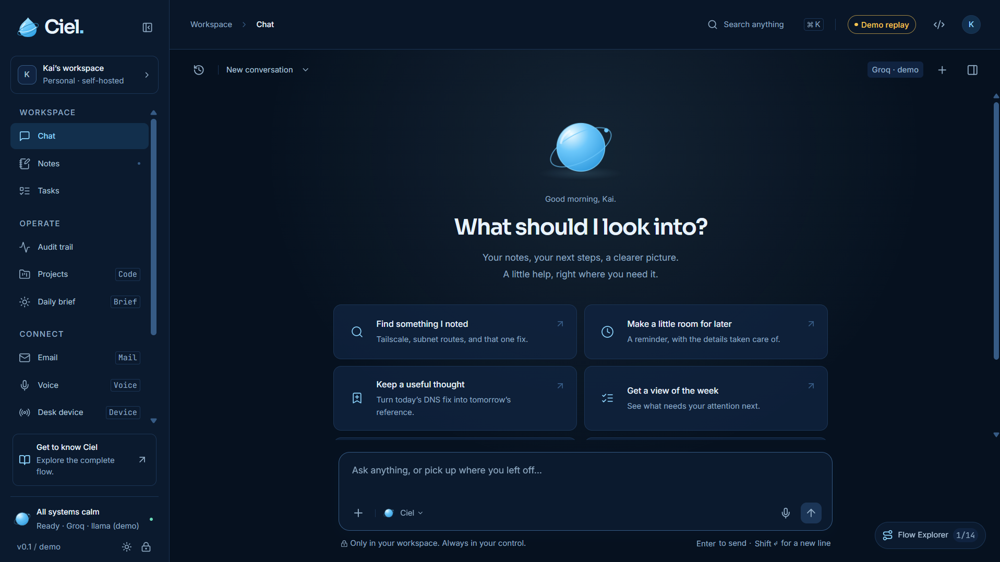
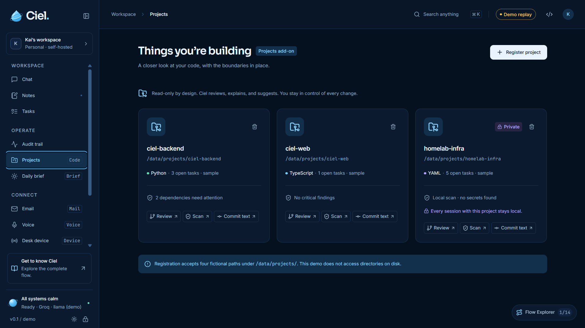
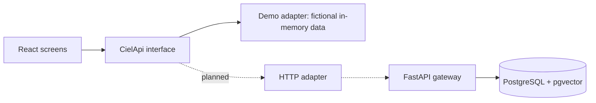

# Ciel

A personal AI IT assistant, built in the open: a complete system design, an interactive frontend demo, and a backend that is being built milestone by milestone.

> **Status: work in progress.** The frontend demo runs end to end on fictional data. The backend currently provides the API foundation (settings guard, health checks, Docker, PostgreSQL with pgvector). Chat, notes and retrieval are not connected to a real model yet.



## What it is

Ciel is designed for one user: capture notes, find them again with cited answers, track tasks, and let an AI agent take actions only after you approve each write. The design puts safety first: scoped tools, exact-argument confirmation, verified citations, and an audit trail.

## What works today

| Area                                                                                                          | Status                            |
| ------------------------------------------------------------------------------------------------------------- | --------------------------------- |
| Frontend demo (React, TypeScript): 12 screens, 15 scripted chat scenarios, confirmation-gated writes          | Working, fictional in-memory data |
| Backend API: FastAPI app, startup guard that rejects weak secrets, JSON request logs without query strings    | Working                           |
| Health checks: `/healthz` (process is alive) and `/readyz` (database reachable)                               | Working                           |
| Docker Compose: PostgreSQL 16 with pgvector, API container, separate owner and least-privilege database users | Working                           |
| Database schema (7 tables) and migrations                                                                     | Next                              |
| Bearer-token authentication for `/api/v1`                                                                     | Next                              |
| Notes, retrieval with citations, tasks, streaming chat, tool confirmation                                     | Planned (see roadmap)             |

## Screenshots



## Quick start: frontend demo

Requires **Node.js 25.6.1** and **npm 11.9.0** (see `.nvmrc`). From the repository root:

```sh
npm ci
npm run dev
```

Open http://127.0.0.1:5173, select **Use demo token**, then **Unlock workspace**. The token is fictional, and no API key, model provider or account is needed. Reloading resets the demo.

## Quick start: backend

Requires Docker. From the repository root:

1. Copy `.env.example` to `.env` (the file is git-ignored; never commit it).
2. Generate three different 64-character secrets, for example with `python -c "import secrets; print(secrets.token_hex(32))"`.
3. In `.env`, set `CIEL_TOKEN`, `POSTGRES_PASSWORD`, `CIEL_DB_APP_PASSWORD`, `DATABASE_URL` and `DATABASE_OWNER_URL`:

   ```text
   DATABASE_URL=postgresql+psycopg://ciel_app:<CIEL_DB_APP_PASSWORD>@db:5432/ciel
   DATABASE_OWNER_URL=postgresql+psycopg://ciel:<POSTGRES_PASSWORD>@db:5432/ciel
   ```

4. Start the database and API, then check them:

   ```sh
   docker compose up -d --build db api
   curl http://127.0.0.1:8000/healthz
   curl http://127.0.0.1:8000/readyz
   ```

`/readyz` returns `503` while the database is down and `200` once it is reachable. Ports are bound to `127.0.0.1` only. The API container never receives the database owner credentials.

## Architecture

The implemented frontend talks to a typed `CielApi` interface. Today that interface is served by an in-memory demo adapter, which is how the interface was designed and tested before the backend existed.



The solid path runs today. The dotted path is the target described in the [architecture](docs/architecture.md) and [API specification](docs/api.md). Key design decisions:

- **Least privilege:** the API connects to the database as a limited user. Only a separate migration job uses the owner account.
- **Fail fast:** the API refuses to start with short or placeholder tokens.
- **Write confirmation:** write tools pause until you approve the exact arguments (specified in [security](docs/security.md), demonstrated in the frontend).
- **Verified citations:** answers cite only notes the server actually retrieved.

## Tech stack

| Area                | Technology                                                    |
| ------------------- | ------------------------------------------------------------- |
| Frontend            | React, TypeScript, Vite, Zustand, Tailwind CSS, Framer Motion |
| Backend             | Python 3.14, FastAPI, SQLAlchemy, psycopg, pydantic-settings  |
| Database            | PostgreSQL 16 with pgvector                                   |
| Infrastructure      | Docker, Docker Compose                                        |
| Testing and quality | Vitest, ESLint, pytest, ruff                                  |

## Testing

```sh
# Frontend (repository root)
npm test
npm run lint
npm run build
```

```sh
# Backend (from backend/, inside a virtual environment)
pip install -r requirements-dev.txt
python -m pytest
ruff check .
```

The frontend has 88 tests covering scripted flows, canonical hashing, citations, confirmations and API invariants. The backend has 9 tests covering the startup guard and health endpoints.

## Roadmap

- [x] Frontend demo and system specification
- [x] Backend foundation: FastAPI app, startup guard, `/healthz`, `/readyz`
- [x] Docker Compose with PostgreSQL, pgvector and separated database roles
- [ ] Database schema and migrations (notes, chunks, tasks, sessions, messages, tool calls, pending confirmations)
- [ ] Bearer-token authentication
- [ ] Knowledge core: notes, embeddings, retrieval with citations
- [ ] Work tools and the confirmation flow
- [ ] Connect the web UI to the real API and run the evaluation suite

Later milestones (coding tools, web search, email, voice, a physical device) are specified in the [documentation](docs/mvp.md) and are not started.

## Project structure

```text
Ciel/
├── backend/            FastAPI app, tests, Dockerfile
├── db/init/            First-boot script that creates the least-privilege database user
├── docker-compose.yml  PostgreSQL, API and a migration job
├── web/                React frontend and demo adapter
├── docs/               Architecture, API, security, MVP scope, evaluation, design
├── .env.example        Configuration reference (placeholders only)
├── AGENTS.md           Rules for AI coding agents working in this repository
└── LICENSE
```

## How this project is built

Most of the code is written with AI coding agents under strict rules in [AGENTS.md](AGENTS.md): one small task at a time, no unrequested changes, no access to secrets, and every change reviewed against the specification and checked with tests before it is committed. I write the specification, direct each step and review the results.

## Documentation

| Document                             | Contents                                           |
| ------------------------------------ | -------------------------------------------------- |
| [Architecture](docs/architecture.md) | Components, data model, deployment design          |
| [API](docs/api.md)                   | Endpoint contracts, error types, streaming events  |
| [Security](docs/security.md)         | Threat model and guardrails                        |
| [MVP scope](docs/mvp.md)             | Core requirements and acceptance criteria          |
| [Evaluation](docs/evaluation.md)     | Testing approach and quality targets               |
| [Interface design](docs/DESIGN.md)   | Visual language and interaction                    |
| [Frontend guide](web/README.md)      | Demo commands, shortcuts and simulation boundaries |
| [Contributing](CONTRIBUTING.md)      | Development workflow                               |
| [Security policy](SECURITY.md)       | Reporting vulnerabilities                          |

## License

MIT. See [LICENSE](LICENSE).

## Author

Jian Kieth Cabahug
